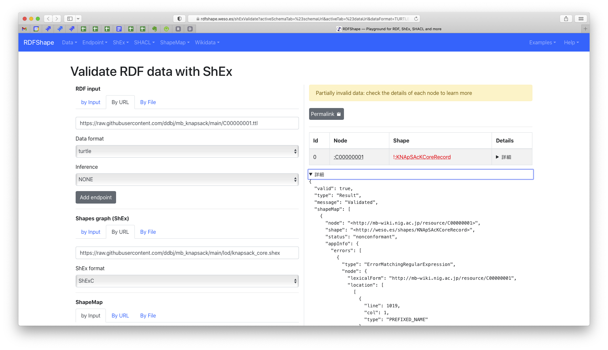

## タイトル
Shexerを利用したHigh-quality RDF生成の自動化を目指して

## 概要
一部の人類は、既存オントロジーや新規オントロジーを利用して既存のリソースのLOD化を繰り返し行っている。さらに自分の作ったLODと他人の作ったLODをデータ統合して、新しいサービスや知識を提供しようと努力を繰り返しているが、http/httpsの揺れや同じリソースを示すURIが複数存在することで、繋がるはずのデータが繋がらず、結果としてRDFのキュレーションをするという苦行を繰り返し経験している。LODはデータのウェブであり、複数の主体により構築されたデータが相互に参照しあうことで巨大な知識グラフが構成され、その価値が最大化される。その一方で、複数の主体が構築することからこそ、先述のような差異が生じてしまい、データのウェブが持つ本来の価値が毀損されてしまう。また、この問題は、人手による作業ではどうしても避けられないとの認識を我々は抱いており、機械による半自動化が必須であると考えている。我々は、現在、様々なLODとの接続が期待され、植物を中心と代謝産物および文献知識に基づいた由来生物や生物活性情報などのアノテーションが集積されたNApSAcK familyデータベースの RDF化に取り組んでいる。この星５つのRDFを星６つのHigh-quality RDFに昇華させるための苦行を自動化を目指して、具体例として、この課題を解決するためのアプローチを提案する。


## 概要・イメージ

RDFの再利用サイクル

- Schema & RDF refinement
- warning/error時のAuto suggestion） 

```
RDF（⭐️⭐️⭐️⭐️⭐️）←------------------------------|
 ↓ shexer           ←---------------------|      |
ShEx Auto generation → Add/Edit schema ---|      | 
 ↓ rdf shex                                      |
RDF validation  → Add/Edit RDF ------------------|
 ↓
High-quality RDF （⭐️⭐️⭐️⭐️⭐️⭐️）
```

## 詳細

KNApSAcK RDFデータセットを利用して、shexerによるshex schemaの生成とおよびshex validationを実行した。

### shexerの実行
```
$ python gen_shex.py
```

### shex validationの実行

#### GUIの場合
https://rdfshape.weso.es/shExValidate?activeSchemaTab=%23schemaUrl&activeTab=%23dataUrl&dataFormat=TURTLE&dataFormatUrl=TURTLE&dataURL=https%3A%2F%2Fraw.githubusercontent.com%2Fddbj%2Fmb_knapsack%2Fmain%2FC00000001.ttl&endpoint=&inference=None&schemaEmbedded=false&schemaEngine=ShEx&schemaFormat=ShExC&schemaFormatUrl=ShExC&schemaURL=https%3A%2F%2Fraw.githubusercontent.com%2Fddbj%2Fmb_knapsack%2Fmain%2Flod%2Fknapsack_core.shex&shapeMap=%3Chttp%3A%2F%2Fmb-wiki.nig.ac.jp%2Fresource%2FC00000001%3E%40weso-s%3AKNApSAcKCoreRecord&shapeMapActiveTab=%23shapeMapTextArea&shapeMapFormat=Compact&shapeMapFormatTextArea=Compact&triggerMode=shapeMap




#### CUIの場合

既存のshex validation実装のテストおよびruby実装の試用

```
[tf@at044 lod]$ rdf shex knapsack_core_2021-08-28_exsample.ttl   --schema knapsack_core.shex --focus http://mb-wiki.nig.ac.jp/C00000001
ERROR Focus nodes with no start: expression: (schema (prefix (("rdf" <http://www.w3.org/1999/02/22-rdf-syntax-ns#>) ...
```

## 発展

